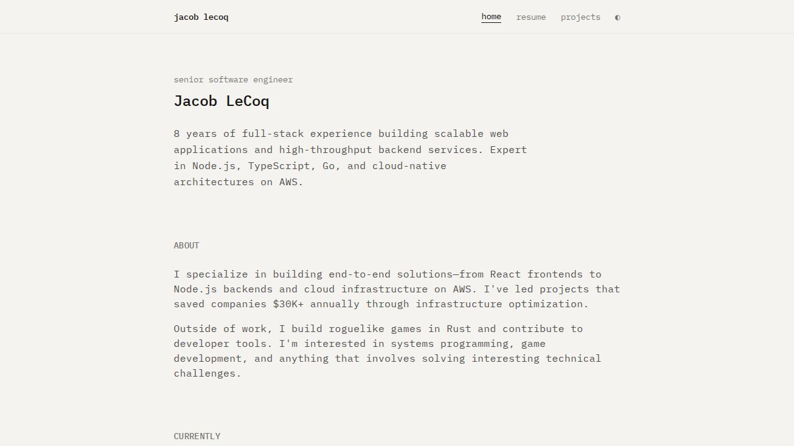
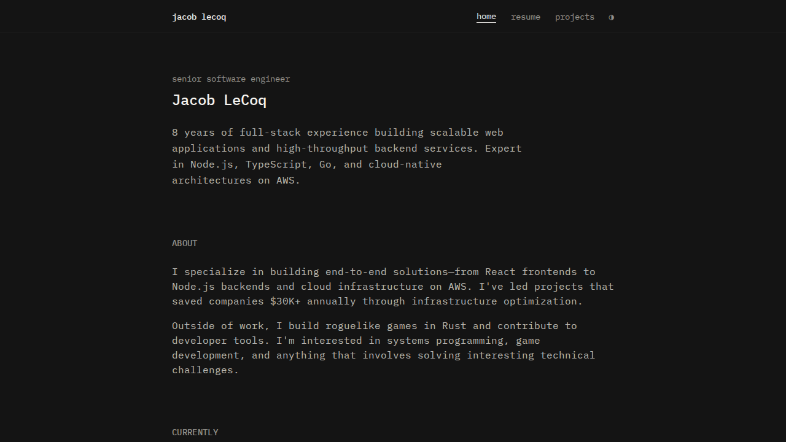
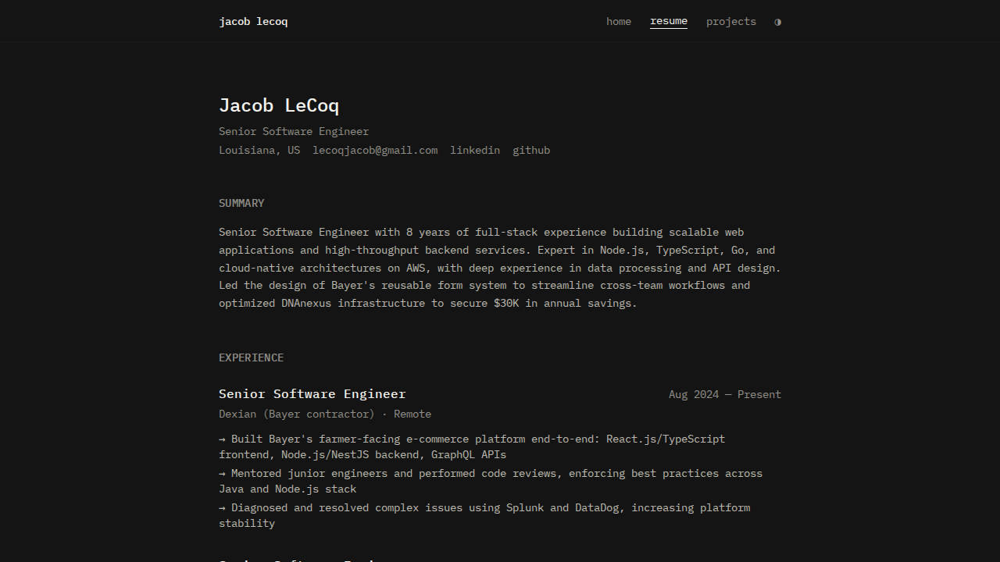
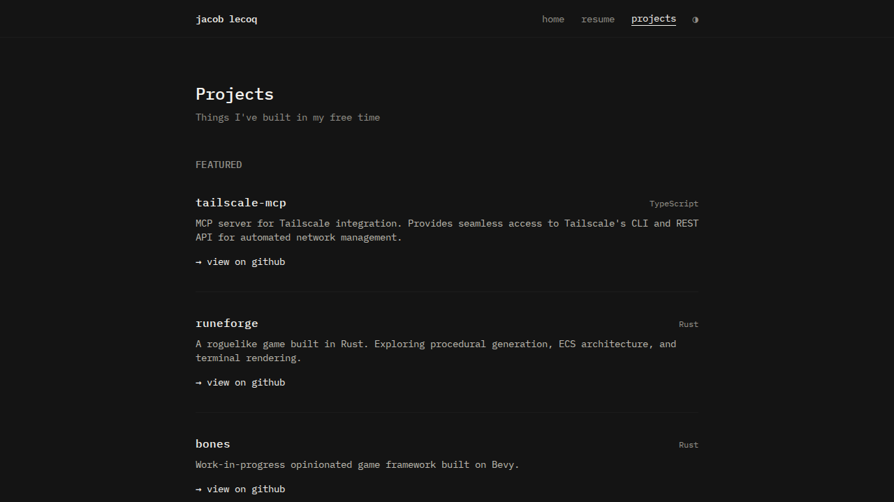

# Portfolio

A minimal, professional portfolio website built with Go and Tailwind CSS.

## Screenshots

### Light Mode


### Dark Mode






## Features

- **Minimal design** — Clean typewriter aesthetic with IBM Plex Mono font
- **Dark/light mode** — Toggle with system preference detection and persistence
- **Responsive** — Works on desktop and mobile
- **GitHub integration** — Automatically fetches and displays repositories
- **Fast** — Server-side rendered with Go, styled with Tailwind CSS CDN

## Pages

- `/` — Home page with bio and links
- `/resume` — Full resume with experience, education, and skills
- `/showcase` — GitHub projects showcase with featured highlights

## Tech Stack

- **Backend:** Go
- **Styling:** Tailwind CSS (CDN)
- **Font:** IBM Plex Mono
- **Database:** SQLite (for visitor tracking)
- **Deployment:** systemd service

## Development

```bash
# Build
go build -o portfolio ./cmd/srv

# Run locally
./portfolio -listen :8000

# Or with make
make run
```

## Deployment

The site runs as a systemd service:

```bash
# Install service
sudo cp srv.service /etc/systemd/system/portfolio.service
sudo systemctl daemon-reload
sudo systemctl enable portfolio
sudo systemctl start portfolio

# Manage
sudo systemctl status portfolio
sudo systemctl restart portfolio
journalctl -u portfolio -f
```

## Customization

Edit the templates in `srv/templates/`:

- `home.html` — Landing page content
- `resume.html` — Resume details
- `showcase.html` — Featured projects

After changes, restart the service:

```bash
go build -o portfolio ./cmd/srv
sudo systemctl restart portfolio
```

## License

MIT
